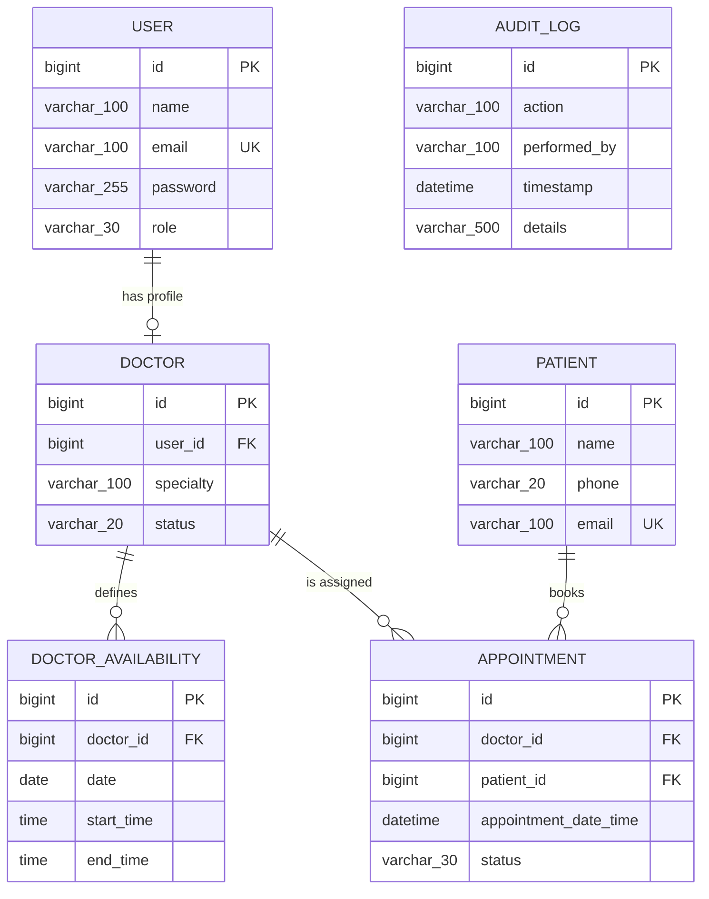

# Clinic Appointment System — Entity-Relationship Diagram

Generated from the JPA entities (`User`, `Doctor`, `Patient`, `DoctorAvailability`,
`Appointment`, `AuditLog`) and cross-checked against all Flyway migrations
(V1–V5). No schema changes have landed since this diagram was first produced —
the Doctor-status and Audit-Log features added afterward both reused existing
columns/tables (`doctors.status` from V4, `audit_log` from V2), so this ERD is
unchanged.

## Notes

- `USER ||--o| DOCTOR`: `doctors.user_id` is `NOT NULL UNIQUE` — every Doctor
  requires exactly one User, and a User has at most one Doctor profile
  (ADMIN/RECEPTIONIST users have none).
- `DOCTOR ||--o{ DOCTOR_AVAILABILITY` and `DOCTOR ||--o{ APPOINTMENT`: both FKs
  are `NOT NULL` on the child side.
- `PATIENT ||--o{ APPOINTMENT`: `appointments.patient_id` is also `NOT NULL`.
- `AUDIT_LOG.performed_by` stores an email as a plain string, not a real
  foreign key, so it has no connecting line above.
- `DOCTOR.status` (ACTIVE/INACTIVE) was added by migration V4 and is now
  exposed/mutable via `PATCH /api/v1/doctors/{id}/status` (ADMIN only).
- `appointments` also carries a database-level `EXCLUDE` constraint
  (`appointments_no_overlap`, added in V3) preventing two non-cancelled
  appointments for the same doctor from overlapping in time — not shown in
  the ERD above since it's a constraint, not a relationship.
