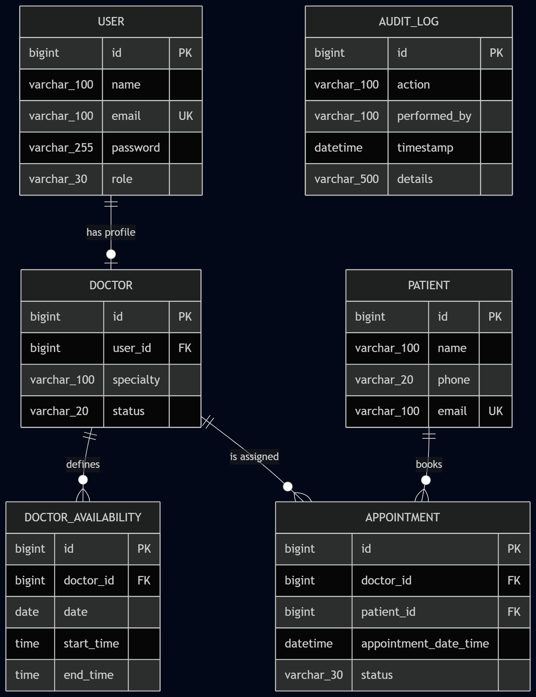
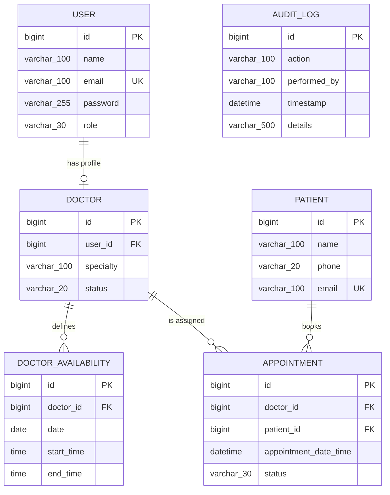

# Clinic Appointment System

A full-stack clinic scheduling app: patients get booked into doctor time slots,
receptionists and admins manage the day-to-day, and doctors manage their own
schedule — all backed by a Spring Boot REST API with JWT auth and a role-aware
React frontend.

## Overview

The system models three roles — **ADMIN**, **RECEPTIONIST**, and **DOCTOR** —
sharing one login and one clinic-wide view of doctors, patients, and
appointments, each scoped to what that role is allowed to see and do. Admins
manage doctor profiles and their bookable status; receptionists and admins
manage patients and book/cancel/reschedule appointments for anyone; doctors
manage their own availability windows and see only their own schedule. Every
mutating action is written to an audit trail, and double-booking is prevented
by both an application-level check and a database-level constraint.

## Tech Stack

| Layer | Technology |
|---|---|
| Backend | Java 17, Spring Boot 4.1, Spring Security (JWT bearer auth), Spring Data JPA / Hibernate, Flyway, springdoc-openapi (Swagger) |
| Frontend | React 19, TypeScript, Vite 8, Tailwind CSS 4, React Router 7, TanStack React Query 5, Zustand 5, Axios |
| Database | PostgreSQL (run via Docker Compose) |

## Demo Accounts

**The shared password for every seeded account below is `Password123!`.**

| Email | Role | Name |
|---|---|---|
| `admin@medclinique.com` | ADMIN | Amara Okafor |
| `reception@medclinique.com` | RECEPTIONIST | Priya Nandan |
| `doctor@medclinique.com` | DOCTOR | Dr. Sarah Chen (Cardiology) |
| `marcus.bello@medclinique.com` | DOCTOR | Dr. Marcus Bello (Orthopedics) |
| `elena.petrova@medclinique.com` | DOCTOR | Dr. Elena Petrova (Pediatrics) |

These accounts, plus 5 patients, doctor availability windows, and a handful of
pre-booked appointments, are seeded automatically by the `V5__seed_demo_data.sql`
Flyway migration the first time the backend starts against a fresh database —
no manual setup needed to have real data to click through.

## How to Run

### Quick start with Docker (database only, for local/manual dev)

A `compose.yaml` at the project root defines just the PostgreSQL container the
*locally-run* backend expects (`clinic_db` / `clinic_user` / `clinic_password`,
exposed on host port **5433**).

```bash
docker compose up -d
```

Spring Boot's Docker Compose support will also auto-start this container for
you the first time you run the backend (`mvnw spring-boot:run`), as long as
Docker Desktop is running — you can usually skip this step and let it happen
automatically.

To run the *entire* app (database + backend + frontend) in containers instead
of running the backend/frontend locally, see
[Running with Docker](#running-with-docker) below.

### Manual / local setup

**Backend** (from the project root):

```bash
./mvnw spring-boot:run
```

This applies all Flyway migrations automatically on startup (schema +
constraints + demo seed data) and starts the API on `http://localhost:8080`.
No separate migration command is needed.

**Frontend** (from `frontend/`):

```bash
npm install
npm run dev
```

Starts the Vite dev server, by default on `http://localhost:5173`. The
backend's CORS config allows origins `5173`–`5175` for local development.

Log in with any of the [demo accounts](#demo-accounts) above.

## Running with Docker

For running the whole app — database, backend, and frontend — in containers,
without installing Java, Maven, or Node locally. Uses `docker-compose.yml` at
the project root (a separate file from the `compose.yaml` above, which only
covers the database for local/manual dev).

```bash
docker compose -f docker-compose.yml up --build
```

This builds and starts three services:

| Service | Image/build | Host port | Notes |
|---|---|---|---|
| `postgres` | `postgres:latest` | not exposed to host | Named volume `postgres_data`; healthcheck via `pg_isready` |
| `backend` | multi-stage Maven → JRE build (`Dockerfile`) | `8080` | Waits for postgres to be healthy; runs Flyway migrations (schema + demo seed data) automatically on startup |
| `frontend` | multi-stage Node → nginx build (`frontend/Dockerfile`) | `5173` (→ container port 80) | Static build served by nginx, with SPA fallback routing |

Once all three are up, open `http://localhost:5173` and log in with any of the
[demo accounts](#demo-accounts) above.

**Configuration**: DB credentials and the JWT secret are passed as environment
variables in `docker-compose.yml` with demo-only defaults (`POSTGRES_DB`,
`POSTGRES_USER`, `POSTGRES_PASSWORD`, `JWT_SECRET`) — override them (e.g. via
a `.env` file next to `docker-compose.yml`) rather than relying on the
defaults for anything beyond local demo use. The frontend's API base URL
(`VITE_API_BASE_URL`) is a **build-time** arg (Vite inlines it at build time,
not runtime) — it defaults to `http://localhost:8080`, which works as-is
because the browser calls the backend directly via its host-exposed port, not
through the frontend container.

To stop and remove everything, including the database volume:

```bash
docker compose -f docker-compose.yml down -v
```

## API Documentation

Once the backend is running, interactive API docs are available at:

- Swagger UI: `http://localhost:8080/swagger-ui.html`
- Raw OpenAPI spec: `http://localhost:8080/v3/api-docs`

See also `BACKEND_CONTEXT.md` for a hand-maintained endpoint-by-endpoint
reference (roles, request/response shapes, error codes) kept in sync with the
actual controllers.

## Main Design Choices

- **Layered architecture**: Controller → Service → Repository, with JPA
  entities kept internal and DTOs (Java records) as the API's public shape.
- **JWT auth**: stateless bearer tokens (`POST /auth/login` / `/auth/register`),
  24-hour expiry, validated per-request by a `JwtAuthenticationFilter` ahead of
  Spring Security's normal auth flow. No server-side session state.
- **Role-based access**: enforced with `@PreAuthorize` at the controller level
  (`@EnableMethodSecurity`), backed by service-layer ownership checks for
  DOCTOR-scoped resources — e.g. `GET /appointments` always forces a DOCTOR
  caller to their own appointments regardless of any `doctorId` filter passed.
- **Double-booking prevention, two layers deep**:
  1. An application-level overlap check in `AppointmentServiceImpl` before
     every insert/update, returning a clean `409` on conflict.
  2. A Postgres `EXCLUDE` constraint (`appointments_no_overlap`, via
     `btree_gist`) on `(doctor_id, tsrange(appointment_date_time, +30min))`
     for all non-cancelled appointments — a database-level safety net that
     closes the race-condition window the app-level check alone can't cover
     under real concurrency. Either layer can reject a conflicting write; the
     frontend sees the same `409` shape either way.
- **Audit logging**: every create/update/delete/status-change on Doctors,
  Patients, Availability, and Appointments writes a row (`action`,
  `performedBy` email, `timestamp`, `details`) via a shared `AuditLogService`,
  readable by ADMINs through `GET /api/v1/audit-logs` (optional `action` /
  `limit` filters, most recent first).

## Entity-Relationship Diagram 'ERD'




`AUDIT_LOG.performed_by` stores an email as a plain string, not a real foreign
key, so it has no connecting line above.

## Assumptions

- **Fixed 30-minute appointment slots** everywhere — availability lookup,
  free-slot search, and the overlap/conflict checks (both app-level and the
  Postgres constraint) all assume a flat 30-minute block per appointment.
  There's no per-appointment duration field.
- **Availability is modeled as specific dated windows**
  (`doctor_availability.date` + `start_time`/`end_time`), not a recurring
  weekly schedule — a doctor without an explicit row for a given date has no
  availability that day, even if they're generally available on that weekday.
- **Doctor status is admin-only and single-purpose**: `ACTIVE`/`INACTIVE` can
  only be changed via the dedicated `PATCH /doctors/{id}/status` endpoint, not
  through the general create/update payload — this keeps "can this doctor be
  booked" as an explicit, audited action separate from editing their profile.
- **No lookup of Users by role**: creating a Doctor profile requires knowing
  the target User's numeric id directly (there's no "list users with role
  DOCTOR" endpoint), so the Doctors admin UI just asks for a raw User ID with
  a clarifying label.
- **JWTs are stored client-side** (persisted in the browser via a Zustand
  store) rather than in an httpOnly cookie — acceptable for this project's
  scope, but a production hardening item.
- **CORS is limited to local dev origins** (`localhost:5173`–`5175`), assuming
  the frontend is always run via the Vite dev server during development.

## Known Limitations

- No endpoint to look up `User`s by role (see Assumptions above) — the
  Doctors admin UI works around this with a plain numeric User ID field.
- `POST /auth/register` doesn't return the new user's id, and there's no
  "look up user by email" endpoint either.
- A doctor's `INACTIVE` status blocks new bookings but does not retroactively
  cancel or flag their existing scheduled appointments.
- The Patients and Doctors admin pages don't yet expose a delete action, even
  though the backend supports `DELETE` on both.
- The audit log is append-only and has no UI or endpoint for exporting or
  purging old entries.
